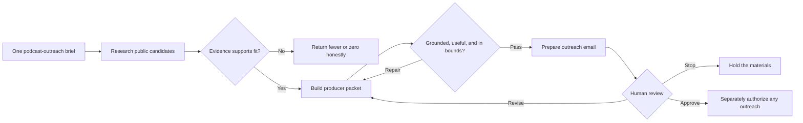

# Completed podcast-outreach example

## One brief, one coordinated marketing team

**Job:** Prepare a research-backed podcast pitch for Sara Davison, Co-Founder
and Strategy Lead at AI Build Lab, for human review.

**Requested outputs:** a shortlist decision, a producer-facing packet, a
prepared outreach email, and the evidence needed to review both.

**Human owner:** Hunter Lee Canning owns the final review and any later decision
about outreach.

## The team

| Role | Owned responsibility | Handoff artifact |
| --- | --- | --- |
| Coordinator | Translate the brief and route the minimum team | Bounded job brief |
| Research lead | Define the public evidence needed to evaluate fit | Research plan |
| Researcher | Assemble and cite relevant public facts | Source-backed fit briefs |
| Strategist | Compare candidates and preserve real constraints | Shortlist decision |
| Packet writer | Turn accepted evidence into a producer-ready story | Producer packet |
| Quality reviewer | Test grounding, fit, tone, and permission boundaries | Findings and repair decision |
| Outreach writer | Prepare a concise introduction to the packet | Draft email |
| Human owner | Approve, revise, or stop | Final decision |

## How the work moved

The live lesson used a visible `15 -> 5 -> 3 -> 1` decision funnel: fifteen
possibilities, five researched candidates, three editorial contenders, and one
completed teaching example. Lenny's Podcast offered a strong story bridge,
while its published guest policy remained an important fit concern rather than
being optimized away.

## Evidence that shaped the decision

| Public evidence | What it changed |
| --- | --- |
| [Lenny's Podcast](https://www.lennysnewsletter.com/podcast) emphasizes practical advice for product and growth builders. | The proposed episode needed a usable operating model, not a broad AI trend conversation. |
| The show's [guest policy](https://www.lennysnewsletter.com/p/lennys-podcast-guest-policy) sets a high bar and generally favors non-founders. | Sara's co-founder title remained a visible booking constraint. |
| A [Jason Lemkin episode](https://www.lennysnewsletter.com/p/we-replaced-our-sales-team-with-20-ai-agents) discussed twenty AI agents still managed by 1.2 humans. | The pitch could explore why more agents do not remove human ownership. |
| A [Fiona Fung episode](https://www.lennysnewsletter.com/p/building-the-most-ai-pilled-engineering) described faster output alongside a context-switching problem. | The angle could connect agent velocity to coordination and judgment. |
| [AI Build Lab](https://aibuildlab.com/) presents Sara as Co-Founder and Strategy Lead. | The packet could accurately position her as a teacher who makes complex agent systems practical. |

## Producer packet

### Proposed guest

**Sara Davison**

Co-Founder and Strategy Lead, AI Build Lab

Sara helps teams turn complex AI systems into practical operating models. Her
work focuses on designing agent roles, handoffs, evidence checkpoints, and
human decisions so organizations can scale useful work without scaling chaos.

### Episode idea

**Your AI agents need an org chart, not another prompt library**

Teams are adding agents faster than they are deciding who owns the result.
Sara would show how to design one agent-native workflow around a clear job,
route the minimum team, make every handoff visible, and keep human judgment at
the point where it creates the most leverage.

### Why it fits this audience

Lenny's audience has already heard what happens when teams add many agents and
when AI increases production speed. This episode answers the operational next
question: how should a product or growth leader organize that capacity so the
work remains understandable and accountable?

### Three listener takeaways

1. Decide which work an agent should own and which work should remain a skill
   or deterministic step.
2. Name the artifact and evidence required at every handoff.
3. Put human judgment before the external effect and before weak work can
   compound.

### Live segment

Take one familiar product or growth workflow and build its working org chart
live: job, roles, handoffs, evidence gates, repair paths, and human decision.

## Prepared outreach email

**Subject:** Boy, do I have a speaker for you: Sara Davison

Hi Lenny's team,

Boy, do I have a speaker for you.

If you haven't heard of Sara Davison, you're about to. She co-founded AI Build
Lab, which has taught more than 2,000 students across 15+ countries.

Sara has a gift for taking complicated AI systems and making them useful. She
can show Lenny's audience how to decide what an agent should own, where a person
needs to step in, and when to stop a workflow before bad output compounds.

You should have her on. I put together a short packet that lays out the episode.

If it clicks, I'll make the intro.

Hunter

AI Build Lab

## Quality findings retained in the example

- **Founder-policy conflict:** A strong editorial idea did not erase the
  show's stated guest preference.
- **Generic AI angle:** Broad claims were replaced with two specific episode
  bridges and a concrete live exercise.
- **Research-heavy outreach:** Evidence shaped the copy without forcing the
  recipient to read the research process.
- **Jargon:** Internal strategy language was simplified before it reached the
  producer packet and email.
- **Booking odds versus teaching value:** The example was useful for teaching
  the workflow even though it did not prove a likely booking.

**Boundary:** These public, review-ready materials do not authorize or claim a
sent message, booked appearance, or connected private runtime.
