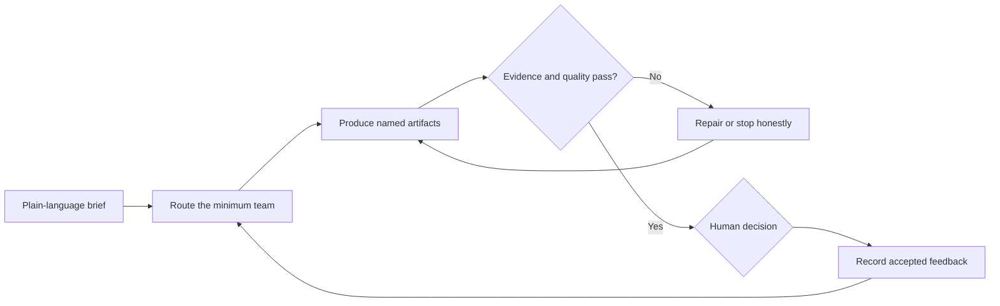

# Build A Working Org Chart for Your AI Agent Workforce

## Edited teaching transcript

This chaptered edition preserves the lesson and demonstration while removing
webinar setup, audience identifiers, contact information, incidental personal
details, repeated remarks, and private implementation details. It is an
editorial teaching transcript, not a verbatim record.

## 1. An org chart should make work understandable

As teams move from one assistant to many specialized agents, the hard problem
changes. It is no longer simply, "Can an agent produce something?" The useful
questions become:

- What job does each part of the team own?
- How does work move from one responsibility to another?
- What evidence shows that the work is good enough to continue?
- Where can a person see what happened?
- What requires human judgment before anything consequential occurs?

A working agent org chart answers those questions. It is not a decorative
diagram or a list of agent names. It is an operating model for reliable,
traceable, repeatable work.

The goal is also not to make a person coordinate every specialist by hand. If
the human has to copy every result between agents, explain the context again,
and chase every status update, the organization has merely created a new kind
of babysitting. Coordination, delegation, and roll-up are part of the design.

## 2. Start with one job, then route only the needed team

The live build began with a plain-language brief: research podcasts that could
fit AI Build Lab, identify a strong example for Sara Davison, prepare a useful
producer packet, and draft the outreach email for review.

That request did not need every available agent. A coordinating role translated
the brief and routed the relevant work to a small marketing team. The useful
responsibilities were strategy, research coordination, research, production,
quality review, and human approval.

This is the first important design principle: organize around owned jobs, not
around the largest possible number of agents. A department should understand
its objective, the work it may accept, the artifacts it must return, and the
limits on what it may do.

The coordinating role is not there to perform every task. It keeps the outcome
and organizational context visible, routes work to the team that should own it,
and rolls the result back up for a decision.

## 3. Agents have skills; skills are not agents

The lesson distinguishes an agent from a skill. A skill is a procedure, method,
or repeatable way of doing something. An agent may use multiple skills while it
owns a job, works with context, produces artifacts, and participates in
handoffs.

Putting a collection of skills beneath a box does not automatically create an
agent organization. The operating design still needs:

- a clear job for each team;
- responsibility for decisions, coordination, production, and review;
- routing so irrelevant teams are not invoked;
- named artifacts at each handoff;
- guardrails that restrict effects; and
- a human who owns the final outcome.

Some responsibilities may deserve distinct agents. Others may be better as a
skill, a deterministic check, or a normal software step. The right answer is
not the biggest org chart. The right answer is the smallest structure that
makes ownership and quality clearer.

## 4. Make every handoff visible through an artifact

The marketing demonstration turned one brief into a visible chain of work:

1. The brief defined the desired outcome and the person being represented.
2. Research assembled a candidate set of podcasts from public information.
3. A decision stage compared audience fit, editorial fit, and constraints.
4. Production shaped the selected evidence into a producer-facing packet.
5. Outreach prepared a concise email linked to the packet.
6. Quality review surfaced weak claims, generic language, and fit conflicts.
7. The completed materials returned to a person for review.

The demo narrowed fifteen possibilities to five researched candidates, then
three editorial contenders, then one clear teaching example. Lenny's Podcast
was selected because the audience and recent episode themes created a specific
story bridge. The work did not hide a meaningful constraint: the show's
published guest policy made the fit more difficult. Keeping that tension
visible made the result more trustworthy than simply declaring a perfect match.

The packet and email were separate artifacts with different jobs. The packet
gave a producer a fast, useful picture of the guest, episode idea, listener
value, and supporting sources. The email opened the conversation without
dumping the research process into the recipient's inbox.

That separation matters. "Research passed to writing" is vague. "A
source-backed fit brief passed to the packet writer" can be inspected. Each
handoff should name what moved, who owned it, what shape it needed, and what
proof allowed the next stage to begin.

## 5. Research, strategy, production, and QA are different jobs

An Agent Native Marketing Team is valuable because it coordinates different
kinds of judgment. Research finds evidence. Strategy decides what the evidence
means for the objective. Production turns an accepted direction into an asset.
Quality review tests the asset against the evidence, audience, tone, and safety
boundary.

Those jobs can operate in parallel when their inputs are ready, but parallel
work does not remove dependencies. A packet should not invent a claim while
research is incomplete. An email should not outrun the decision about fit. A
polished asset should not be treated as proof that the underlying reasoning was
sound.

The demonstration also showed why review needs a repair path. Some research
leaned too heavily toward AI-specific shows. Some internal wording became
jargony. A proposed angle could be too generic, and a strong editorial idea
could still have weak booking fit. Review findings should return the work to
the responsible stage or stop it, not disappear behind a green status.

The honest output of a research workflow may be fewer qualified results than
requested, or none. Designing that outcome in advance prevents the team from
manufacturing confidence merely to fill a quota.

## 6. Guardrails must exist in the system, not just in the copy

Human-in-the-loop is not a decorative label. The team should know which work
it may prepare and which effect it may not create. In this example, the useful
endpoint was a review-ready packet and prepared email. A person still owned the
decision to revise, approve, or stop.

Guardrails can include restricted tools, read-only stages, draft-only outputs,
required evidence, approval checkpoints, and explicit stop conditions. A
statement such as "do not send" is stronger when the system also lacks send
authority until a separate human decision grants it.

Observability supports that control. The operator should be able to see which
stage ran, what artifact it produced, what evidence it used, what failed, what
was repaired, and what is waiting for a decision. The purpose is not to expose
an unreadable wall of internal activity. It is to create a useful roll-up with
the option to inspect the evidence beneath it.

## 7. Use evaluation to improve the team, not merely score it

Quality findings become valuable when they change the next run. If an angle is
off-brand, a source is weak, or an artifact is too dense, capture the reason in
a form that can improve the responsible role or handoff.

Evaluation is therefore part of the operating loop:

The system becomes more useful when feedback improves future decisions without
silently expanding autonomy.

## 8. Start smaller than the org chart in your imagination

Do not begin by cloning a giant collection of agents. Begin with one meaningful
job and the minimum roles needed to make its handoffs reliable. Learn which
responsibilities truly need an agent, which should be a skill, and which are
better as deterministic software.

For a first marketing workflow, define:

1. one useful result;
2. one accountable human owner;
3. the minimum research, decision, production, and review roles;
4. one named artifact at every handoff;
5. the evidence required to continue or stop; and
6. the exact edge where human permission is required.

That is a working org chart: not more boxes, but clearer ownership, observable
work, better decisions, and a team a person can direct instead of babysit.
