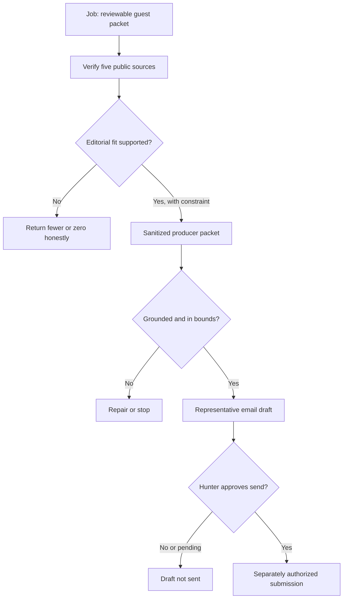

# Lenny's Podcast public worked specimen

> **Public worked specimen.** Reconstructed from verified public sources and a
> prepared AIBL outreach package. No outreach was sent. This page is not
> connected to the private runtime.

This is prepared editorial teaching material, not a completed live-runtime
receipt. Its public policy state is `submission_not_dispatched`; that label does
not claim that a private run reached this state.

## Job

Prepare a grounded guest idea for Sara Davison, Co-Founder and Strategy Lead at
AI Build Lab, to appear on Lenny's Podcast.

The reviewable result is one public-source research brief, one producer-facing
episode concept, and one representative email draft. A named human must still
approve, revise, or stop the work. A weak fit or insufficient evidence may
honestly produce no packet.

## Verified public sources

| Evidence | Narrow finding | Why it matters |
| --- | --- | --- |
| [Lenny's Podcast](https://www.lennysnewsletter.com/podcast) | The show emphasizes concrete, actionable advice for product and growth builders. | The episode needs a usable operating model, not a trend discussion. |
| [Guest policy](https://www.lennysnewsletter.com/p/lennys-podcast-guest-policy) | The show generally prefers non-founders and sets a high bar for adjacent-skill exceptions. | Sara's co-founder title is a real fit constraint that must remain visible. |
| [Jason Lemkin episode](https://www.lennysnewsletter.com/p/we-replaced-our-sales-team-with-20-ai-agents) | Twenty AI agents were managed by 1.2 humans. | More agents do not remove the need for human ownership. |
| [Fiona Fung episode](https://www.lennysnewsletter.com/p/building-the-most-ai-pilled-engineering) | Her team ships eight times more code while context switching remains unsolved. | Faster output can move the bottleneck to judgment and coordination. |
| [AI Build Lab](https://aibuildlab.com/) | AIBL identifies Sara as Co-Founder and Strategy Lead and describes her framework, curriculum, and strategy work. | The proposed value is translating complex systems into a usable operating model. |

The conclusion is deliberately mixed: the editorial story is strong, while
the guest-policy fit is difficult. This is a creative worked specimen, not a
claim that a booking is likely.

## Roles

| Role | Responsibility |
| --- | --- |
| Human owner | Sets the outcome and makes the final send/no-send decision |
| Researcher | Finds allowed public evidence about the show and audience fit |
| Verifier | Checks that claims are supported by the linked public sources |
| Packet writer | Turns verified evidence into a guest angle and briefing packet |
| Quality reviewer | Checks fit, grounding, tone, and public/private boundaries |
| Outreach drafter | Prepares a representative email draft but cannot send it |

Roles are responsibilities. They do not disclose how AIBL privately assigns
models, tools, prompts, or infrastructure.

## Handoffs, proof, and permission

| Stage | Public status | Artifact or proof | Duration |
| --- | --- | --- | --- |
| Define the job | Complete for specimen | One bounded outcome: a reviewable guest packet | Duration not published |
| Verify public evidence | Complete for specimen | Five linked public pages | Duration not published |
| Test editorial fit | Complete with constraint | Founder-policy mismatch remains visible | Duration not published |
| Shape the episode | Complete for specimen | Sanitized derivative of a prepared packet | Duration not published |
| Prepare outreach | Complete for specimen | Representative public draft | Duration not published |
| Human approval | Pending | Hunter Lee Canning remains final approver | Not applicable |
| Submission | Not authorized | `submission_not_dispatched` | Not applicable |

## Sanitized producer packet

**Label:** Sanitized derivative

**Guest:** Sara Davison, Co-Founder and Strategy Lead at AI Build Lab

**Episode concept:** Teams are adding agents faster than they are designing
ownership. Sara would show how to decide what an agent should own, where human
judgment belongs, and what stop condition prevents weak work from compounding.

**Why now:** One Lenny conversation showed twenty agents still managed by 1.2
humans. Another showed that eight-times-faster code output can create a
context-switching problem. The proposed episode connects those observations
with a practical operating model.

**Listeners would leave ready to:**

1. Name one bounded job an agent can own.
2. Put human judgment at the highest-leverage handoff.
3. Define the proof required before work moves forward.
4. Set a stop condition before weak output compounds.

This is a revised public framing of prepared editorial material. It is not the
verbatim historical packet and was not submitted.

## Representative public draft

**To:** Lenny's Podcast team - route held

**From:** AI Build Lab

**Subject:** A practical agent-workforce episode with Sara Davison

> Hi Lenny's team,
>
> Two recent conversations point to a practical next question. Jason Lemkin's
> 20-agent experiment still needed 1.2 humans, and Fiona Fung described the
> context-switching problem that came with much faster code output.
>
> How should a product team decide what an agent owns, where a person steps in,
> and when the workflow should stop?
>
> Sara Davison, Co-Founder and Strategy Lead at AI Build Lab, teaches teams to
> turn complex AI systems into clear roles, evidence checkpoints, and human
> decisions. She could map one product workflow live and give listeners a model
> they can adapt.
>
> We prepared a short producer packet with the episode idea and public source
> trail. Would this be useful for your audience?
>
> Best,
>
> AI Build Lab

**Status:** Draft prepared. Human approval pending. Recipient route held. Not
scheduled. Draft not sent.

## What the X-Ray reveals

- The useful result is the inspectable chain, not simply "an agent wrote an
  email."
- Research and verification are different responsibilities.
- The fit constraint remains visible rather than being optimized away.
- The packet, source trail, QA decision, and draft are named artifacts.
- A draft email is not a sent email.
- The human approval edge is visible before any external effect.

## Public/private boundary

This content-free public projection contains no private subject profile,
transcript, prospect contact, mailbox route, image capture, exact prompt, role
configuration, trace payload, runtime identifier, provider recipe, query count,
cost, budget, duration, confidence score, or security control.

**Highest supported state:** verified public sources and prepared editorial
assets support this static specimen. A completed live Lenny campaign is not
proved. Private runtime not connected.

Source: [AI Build Lab](https://aibuildlab.com/live-builds/2026-08-28-ai-agent-workforce),
Workflow X-Ray public method, version `0.2.0`.
