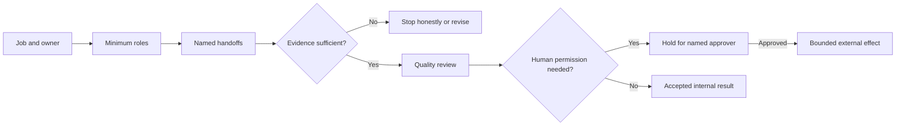

# AIBL Workflow X-Ray lesson

**Promise:** turn one workflow into a visible agent plan so you can see how the
work moves, what evidence matters, and where a person stays in control.

This is a public teaching method. It is not AIBL's private runtime design, and
reading it does not install, execute, or change anything.

The worked lesson uses a static, sanitized Lenny's Podcast outreach specimen
assembled from verified public sources and prepared AIBL editorial assets. No
outreach was sent. It is not connected to the private runtime and does not
prove that a live Lenny campaign completed end to end.

## Why workflows become black boxes

An agent demo can look impressive while hiding basic questions: Who owns the
result? What did the agent actually receive? What artifact crossed each
handoff? What proof let it continue? What happens when the honest answer is
"nothing qualified"? Who permits an external effect?

Workflow X-Ray makes those questions visible before a team adds more tools or
autonomy.

## The five-part X-Ray

### 1. Job

Name one useful result, not a department or a vague ambition.

- Clear: "Prepare one evidence-backed podcast outreach packet for human review."
- Fuzzy: "Automate marketing with agents."

Also name the owner, acceptance checks, and honest stop condition. Zero or
fewer results must remain valid when the evidence does not support more.

### 2. Roles

Use only the roles the job needs. Separate deciding, coordinating, producing,
and checking when those responsibilities create a useful control boundary.
Roles are responsibilities, not necessarily separate models, tools, or people.

### 3. Handoffs

Every handoff moves a named artifact. "Research passes to writing" is vague;
"a source-backed fit brief passes to the packet writer" can be inspected.
Record the expected shape, owner, and status of the artifact.

### 4. Proof

Define what evidence lets the workflow proceed. Useful proof can include cited
sources, required fields, review findings, timestamps, content hashes, or a
quality rubric. Activity, confidence language, and a green dashboard are not
proof by themselves.

### 5. Permission

Separate drafting from external effects. Name the person who may approve a
send, publication, purchase, deployment, account change, or other consequence.
Define where the system must stop and what the approver will see.

## Read the map

The map is useful because the visible objects can be challenged. If an owner,
artifact, evidence gate, stop condition, or approval edge is missing, the plan
is not ready merely because the boxes connect.

## What your agent should produce

For one workflow, ask for four artifacts:

1. A Mermaid workflow map with holds and stop conditions.
2. A handoff table: stage, owner, input, output, proof, next decision.
3. A black-box report: unknowns, unsupported assumptions, unsafe autonomy, and
   missing evidence.
4. A first-build slice: the smallest internal or draft-only result worth
   testing before any external effect.

## Try it on your workflow

Answer these five questions:

1. What single result should exist when the workflow succeeds?
2. Who owns the result, and which roles are actually needed?
3. What named artifact should cross each handoff?
4. What proof should allow the workflow to continue or stop?
5. What needs human permission, and who may grant it?

The agent should label assumptions instead of filling gaps with invented
certainty. It should not inspect your stack or implement the plan unless you
separately authorize a clearly scoped next step.

## Reuse it

After completing the lesson, you can ask your agent to save Workflow X-Ray as a
project or personal/global skill. It must first show the proposed scope,
destination, and complete file list. A request to preview the skill is not
permission to write it.

Source: [AI Build Lab](https://aibuildlab.com/live-builds/2026-08-28-ai-agent-workforce),
Workflow X-Ray public method, version `0.2.0`.
